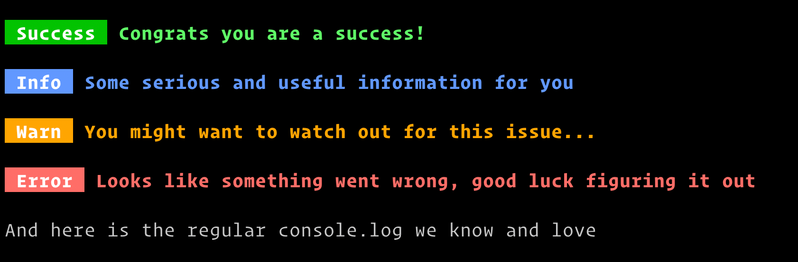

# @notthedom/logged

## What is it?

> A variety of styled equivalents of console.log

## Installation

> The module is scoped to my npm account, hence the `@notthedom` in the install command

```shell
npm install --save-dev @notthedom/logged
```

- exposes five variations of logging functions as **named** exports.

### The variants

- `success`

- `info`

- `warn`

- `error`

- `log`

  - this is the native `console.log` accessible by a shorter name

## Import & Usage

> esm named import syntax

```javascript
import { success, info, warn, error, log } from '@notthedom/logged';

success('Congrats you are a success!');
info('Some serious and useful information for you');
warn('You might want to watch out for this issue...');
error('Looks like something went wrong, good luck figuring it out');
```

## Example usage screenshot



## Links

- Project repository: https://github.com/dominicvana/logged

- Issue tracker: https://github.com/dominicvana/logged/issues

## Licensing

This project is licensed under MIT license.
